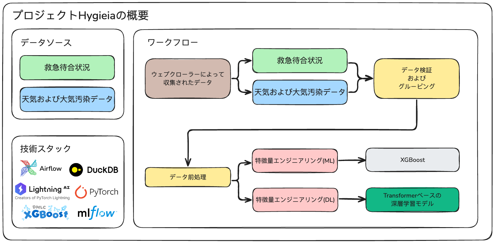
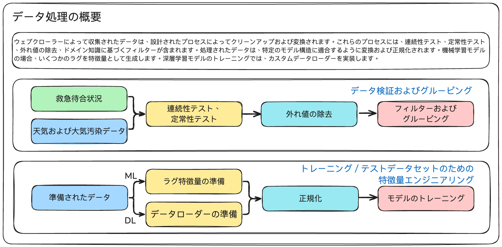
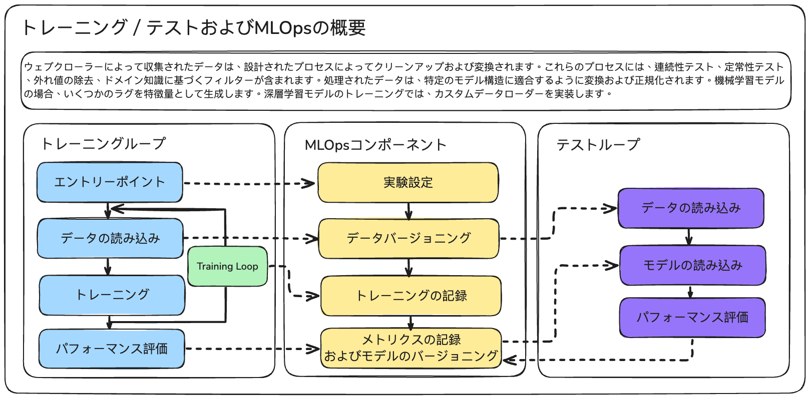

# Hygieia-public

!!! 重要お知らせ !!!
これはプロジェクトHygieiaの公開バージョンです。論文はまだ作成中のため、論文が受理されるまでソースコードは未公開です

## Introduction

Project Hygieiaは、機械学習（ML）および深層学習（DL）を基盤とした時系列予測プロジェクトです。本プロジェクトは、病院の救急部門における救急待合状況を予測することを目的としています。データはウェブクローラーを通じて収集し、病院の救急部門の救急待合状況、天気データ、大気汚染データが含まれます。集めたデータは、連続性テスト、定常性テスト、外れ値除去、ドメイン知識に基づくフィルターなど、いくつかのテストを通じて検証します。処理されたデータには、ターゲットモデルに応じて異なる特徴量エンジニアリングと正規化を施します。また、MLflowツールがトレーニングおよびテストプロセスのMLOpsコンポーネントとして実装されています。

## Data Processing 

ウェブクローラーによって収集されたデータは、設計されたプロセスによってクリーンアップおよび変換されます。これらのプロセスには、連続性テスト、定常性テスト、外れ値の除去、ドメイン知識に基づくフィルターが含まれます。処理されたデータは、特定のモデル構造に適合するように変換および正規化されます。機械学習モデルの場合、いくつかのラグを特徴量として生成します。深層学習モデルのトレーニングでは、カスタムデータローダーを実装します。

## Training/Testing and MLOps

ウェブクローラーによって収集されたデータは、設計されたプロセスによってクリーンアップおよび変換されます。これらのプロセスには、連続性テスト、定常性テスト、外れ値の除去、ドメイン知識に基づくフィルターが含まれます。処理されたデータは、特定のモデル構造に適合するように変換および正規化されます。機械学習モデルの場合、いくつかのラグを特徴量として生成します。深層学習モデルのトレーニングでは、カスタムデータローダーを実装します。

