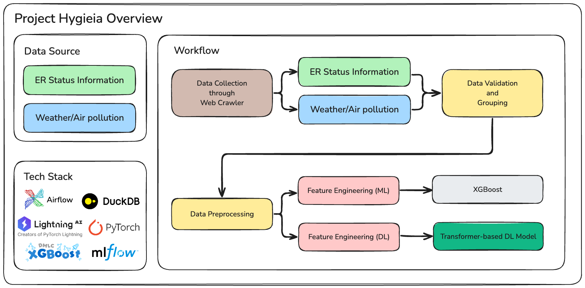
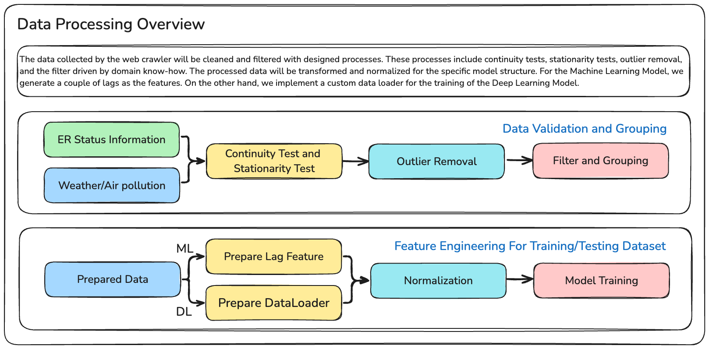
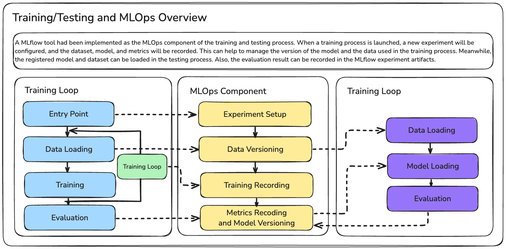

# Hygieia-public

!!! IMPORTANT !!!
This is a public version of Project Hyegia. Since the paper is still work in progress. The source code will not be available until the paper is accepted.

## Introduction

Project Hygieia is a ML/DL-based time series forecasting project. This project aims to forecast the waiting visits in the emergency departments of a hospital. We collect the data through the web crawler. The data prepared to train the ML/DL models includes the waiting status of the emergency department of a hospital, the weather data, and the air pollution data. The data is validated through several tests, including the continuity test, stationarity test, outlier removal, and the filter driven by domain know-how. The processed data is applied with different feature engineering and normalization with respect to the target model. A MLflow tool had been implemented as the MLOps component of the training and testing process.

> For Japanese version, please refer to: [Web page](./README.jp.md)

## Data Processing 

The data collected by the web crawler will be cleaned and filtered with designed processes. These processes include continuity tests, stationarity tests, outlier removal, and the filter driven by domain know-how. The processed data will be transformed and normalized for the specific model structure. For the Machine Learning Model, we generate a couple of lags as the features. On the other hand, we implement a custom data loader for the training of the Deep Learning Model.

## Training/Testing and MLOps

A MLflow tool had been implemented as the MLOps component of the training and testing process. When a training process is launched, a new experiment will be configured, and the dataset, model, and metrics will be recorded. This can help to manage the version of the model and the data used in the training process. Meanwhile, the registered model and dataset can be loaded in the testing process. Also, the evaluation result can be recorded in the MLflow experiment artifacts.

